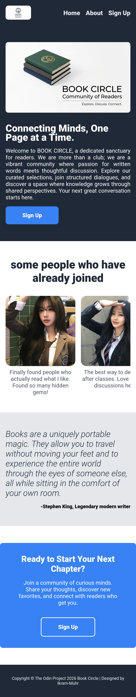

# Landing Page

A clean, minimalist landing page designed for Book Circle, a digital community for students and book lovers. This project focuses on modern UI/UX principles, featuring a responsive layout and optimized assets to provide a seamless user experience.

---

## 🧑‍🏫 Desired Outcome

---

## 👠 Style Guide

---

## 🔗 Live Demo

[Click here to view the live demo](https://ikram-muhr.github.io/odin-foundations-course/02-landing-page)

---

## 📸 Screenshot

### 💻 Desktop

### 📱 Tablet

### 📲 Mobile

## 🛠️ Built With

- **HTML5**
- **CSS3**

---

## 💡 What I’ve Learned

- How to implement a web design into actual HTML and CSS code
- How to use Flexbox to create the desired design
- How to create a simple navigation bar with the “position: sticky” property
- How to create a container that holds multiple images and is responsive to small screen sizes by making it horizontally scrollable
- Create a landing page structure using clean, semantic HTML

## 🤔 The Challenges I Face

- How can I make a landing page responsive on small screens without it looking odd? The solution is to use the `flex-direction: column;` property.
- How can I make sure a collection of images on a small screen remains easy to view and isn’t too long? I found that the solution is to use the `scroll-x: auto;` property on the image container.

## 🚧 What I Want to Improve

- **Make the navigation bar more responsive on small screens by turning it into an** icon that, when clicked, displays a pop-up navigation menu
- **Add animations** to the landing page, particularly to the images, both during loading and when they first appear

---

## 📎 Source

- [The Odin Project](https://www.theodinproject.com/lessons/foundations-landing-page)